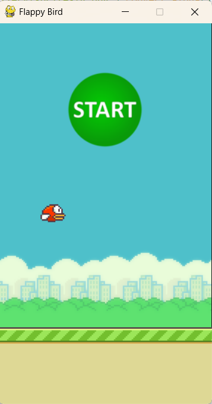
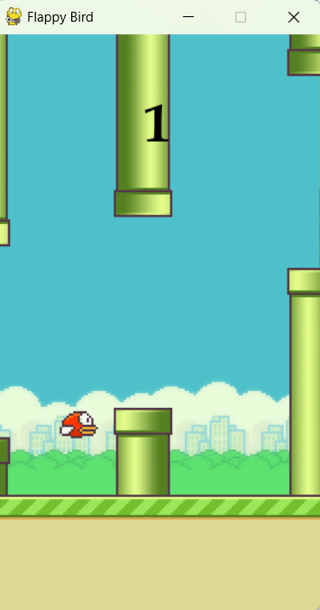

# Flappy Bird Game

This is a simple implementation of the popular game Flappy Bird using the Pygame library.

## Description

Flappy Bird is a side-scrolling game where the player controls a bird, attempting to fly between columns of green pipes without hitting them. The player earns points for successfully passing through the gaps between the pipes.

The game offers two modes: normal and fast. In normal mode, the player can press the "1" key to start the game, while in fast mode, the "2" key is used. The objective of the game is to achieve the highest score possible by navigating the bird through the pipes.

## Getting Started

To play the game, follow these steps:

1. Clone the repository from GitHub:
   ```
   git clone https://github.com/Abhishekkgpian/Flappy-Bird-Game.git
   ```

2. Change to the `gallery` directory:
   ```
   cd gallery
   ```

3. Run the `main.py` file:
   ```
   python main.py
   ```

4. On the welcome screen, press the "1" key for normal mode or the "2" key for fast mode to start the game.

## Requirements

- Python 3.x
- Pygame library

## Controls

- Use the spacebar or the up arrow key to make the bird flap its wings and navigate through the pipes.
- Press the Esc key or click the close button to exit the game.

## Screenshots




## License

This project is licensed under the MIT License. See the [LICENSE](LICENSE) file for more information.

